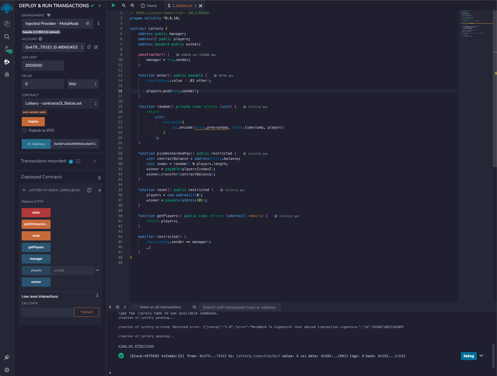
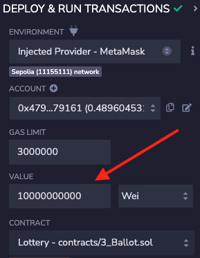
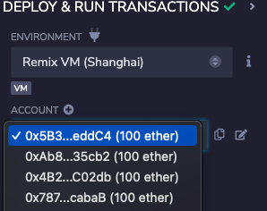

# Web3 Lottery

This is a simple lottery contract that allows users to enter a lottery by sending ether to the contract. Once the lottery has ended, the contract will pick a random winner and send the ether to that address. Only the creator of the contract can start the lottery.

## Pseudorandom winner selection

This contract uses a simple pseudorandom number generator. It is not cryptographically secure, and should not be used in production. It is only used for demonstration purposes.

## Deploying the contract using your machine

Want to deploy this contract yourself? Follow these steps:

1. Clone this repository
2. Run `npm install` to install dependencies
3. Run `npm run deploy` to deploy the contract to the Sepolia test network.

## Deploying the contract with Remix

This demonstration project doesn't have a frontend, so you'll need to use the [Remix IDE](https://remix.ethereum.org) to interact with the contract.

1. Open the [Remix IDE](https://remix.ethereum.org)
2. Create a new file called `Lottery.sol`
3. Copy the contents of `contracts/Lottery.sol` into the new file
4. Go to the `Deploy and Run Transactions` tab
5. Choose one:

- Select `Injected Provider` as the environment if you're using MetaMask OR
- Select one of the Remix VM options if you're not using MetaMask.

6. Click `Deploy` and wait for the contract to deploy.
   If you're using MetaMask, you'll be prompted to confirm the transaction.

> You should now see a new `Lottery` contract in the `Deployed Contracts` section

## How do I play?

1. With an account selected, enter the amount of ether you want to send to the contract.

2. Hit the `enter` button to send the ether to the contract.

3. (optional) Repeat step 2 with different accounts

4. With the account that initially deployed the contract selected, click the `pickWinnerAndPay` button to pick a winner and send the ether to that account.

5. (optional) Hit `reset` to reset the contract and start a new lottery with a new set of players but keeping the same manager.
